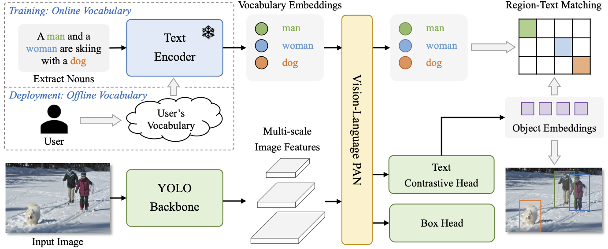
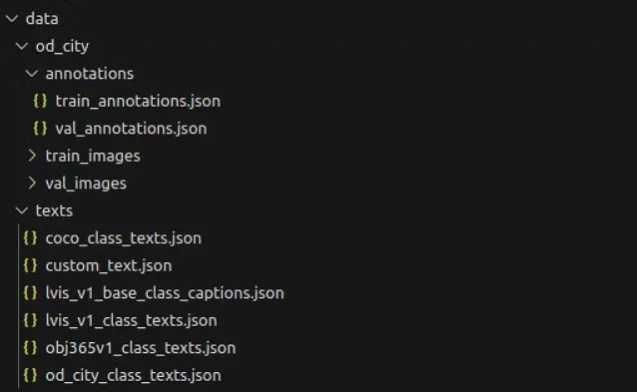
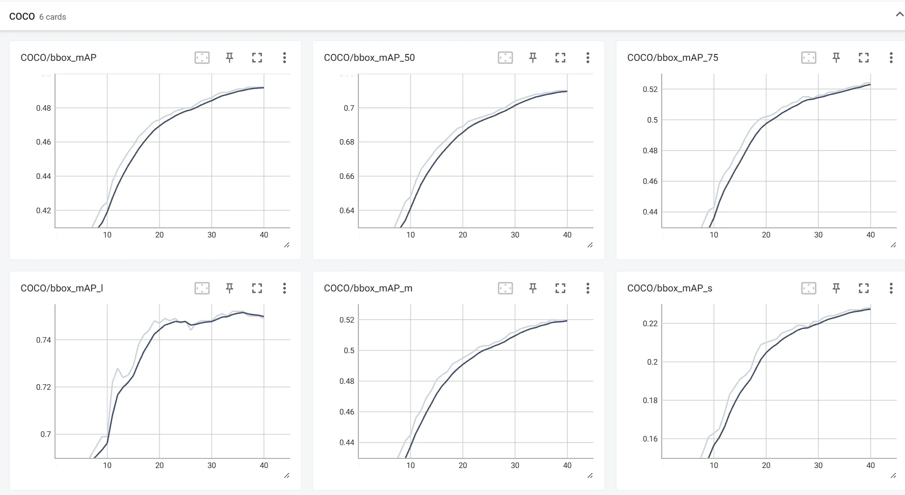

# Finetune-YOLO-World-based-on-your-own-data
The process of performing normal fine-tuning on YOLO-World.

<div align="center">

</div>

## Getting started

### 1. Installation


#### Clone Project 

```bash
git clone --recursive https://github.com/AILab-CVC/YOLO-World.git
```
#### Install

```bash
conda create --name yoloworld python=3.8
pip install torch==1.13.1+cu117 torchvision==0.14.1+cu117 torchaudio==0.13.1 --extra-index-url https://download.pytorch.org/whl/cu117
YOLO-World adopts mmcv>=2.0.0
# cuda=11.7, torch=1.13
https://download.openmmlab.com/mmcv/dist/cu117/torch1.13/index.html
pip install mmcv-2.0.0-cp38-cp38-manylinux1_x86_64

pip install -r basic_requirements.txt
pip install -r demo_requirements.txt
pip install -r onnx_requirements.txt
```

### 2. Preparing Data

Convert existing object detection data and annotations to COCO format, and then organize the files as shown in the following image. Generate your own text JSON file at the same time.

<div align="center">

</div>

### 3. Download pretrained models

```bash
yolo-world model
https://hf-mirror.com/wondervictor/YOLO-World/tree/main

CLIP model
https://huggingface.co/openai/clip-vit-base-patch32
```


## Normal Fine-tuning YOLO-World

### 1. Hyper-parameters and Config
My fine-tuning dataset doesn't contain mask annotations, l choose "yolo_world_v2_l_vlpan_bn_sgd_1e-3_40e_8gpus_finetune_coco".You should adjust the configuration file according to your own situation.

Bug:

```bash
coco_metric.py data[‘category_id’] = self.cat_ids[label] IndexError: list index out of range.
you should change the classname in both "mmdet/evaluation/functional/class_names.py" and "mmdet/datasets/coco.py"
```

### 2. fine-tuning

```bash
python tools/train.py configs/finetune_coco/yolo_world_v2_l_vlpan_bn_sgd_1e-3_40e_8gpus_finetune_coco.py  --work-dir log
```

<div align="center">

</div>

## Demo


- [x] `image_demo.py`: inference with images or a directory of images
```bash
PYTHONPATH=./ python demo/image_demo.py /APP/YOLO-World/configs/finetune_coco/yolo_world_v2_l_vlpan_bn_sgd_1e-3_40e_8gpus_finetune_coco.py /APP/YOLO-World/log/epoch_40.pth /APP/YOLO-World/image_test 'car,truck,person,bicycle,cyclist,van,tricycle,bus' --topk 100 --threshold 0.1 --output-dir demo_outputs
```


## Citations

```bibtex
@inproceedings{Cheng2024YOLOWorld,
  title={YOLO-World: Real-Time Open-Vocabulary Object Detection},
  author={Cheng, Tianheng and Song, Lin and Ge, Yixiao and Liu, Wenyu and Wang, Xinggang and Shan, Ying},
  booktitle={Proc. IEEE Conf. Computer Vision and Pattern Recognition (CVPR)},
  year={2024}
}
```
